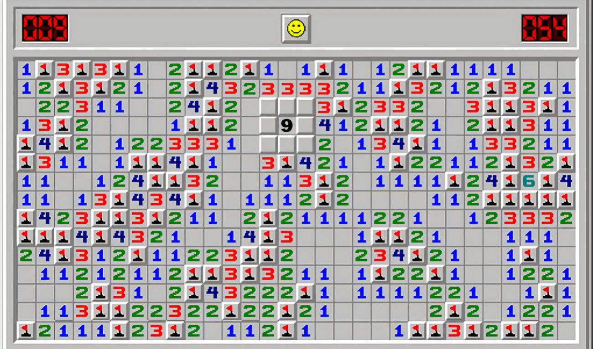

# Minesweeper Game

---

### Description

This Minesweeper game is implemented in HTML, CSS, and JavaScript. The objective is to uncover all safe tiles without detonating any landmines. The game provides different board sizes, and players can mark potential landmine locations with flags.

### How to Play

1. Open the `index.html` file in your browser.
2. Left-click on tiles to uncover them.
3. Right-click on tiles to flag potential landmines.
4. The numbers on revealed tiles indicate the count of adjacent landmines.
5. Uncover all safe tiles to win the game.

### Features

- Multiple board sizes: 8x8, 16x16, and 32x16.
- Left-click to reveal tiles, right-click to flag potential landmines.
- Dynamic rendering of the game board.
- Game won or lost alerts with an option to reset.

### How to Contribute

If you want to contribute to the development of the game, follow these steps:

1. Fork the repository.
2. Clone your fork: `git clone https://github.com/YOUR_USERNAME/minesweeper-game.git`
3. Create a branch for your changes: `git checkout -b your-branch`
4. Make your modifications and commit: `git commit -m "Add new features"`
5. Push your changes: `git push origin your-branch`
6. Open a Pull Request on GitHub.

Your contributions are appreciated! Feel free to follow me on my social media to support this project and others through this link: [https://linktr.ee/mario.conf](https://linktr.ee/mario.conf).

---

## Juego Buscaminas

---

### Descripción

Este juego de Buscaminas está implementado en HTML, CSS y JavaScript. El objetivo es descubrir todas las casillas seguras sin detonar ninguna mina. El juego ofrece diferentes tamaños de tablero, y los jugadores pueden marcar posibles ubicaciones de minas con banderas.

### Cómo Jugar

1. Abre el archivo `index.html` en tu navegador.
2. Haz clic izquierdo en las casillas para descubrirlas.
3. Haz clic derecho en las casillas para marcar posibles ubicaciones de minas.
4. Los números en las casillas reveladas indican la cantidad de minas adyacentes.
5. Descubre todas las casillas seguras para ganar el juego.

### Funcionalidades

- Múltiples tamaños de tablero: 8x8, 16x16 y 32x16.
- Haz clic izquierdo para descubrir casillas, haz clic derecho para marcar posibles minas.
- Renderización dinámica del tablero de juego.
- Alertas de juego ganado o perdido con opción para reiniciar.

### Cómo Contribuir

Si quieres contribuir al desarrollo del juego, sigue estos pasos:

1. Haz un fork del repositorio.
2. Clona tu fork: `git clone https://github.com/TU_USUARIO/juego-buscaminas.git`
3. Crea una rama para tus cambios: `git checkout -b tu-rama`
4. Realiza tus modificaciones y haz commit: `git commit -m "Añadir nuevas funcionalidades"`
5. Sube tus cambios: `git push origin tu-rama`
6. Abre un Pull Request en GitHub.

¡Se agradecen tus contribuciones! Además, sígueme en mis redes sociales para apoyar este proyecto y otros a través de este enlace: [https://linktr.ee/mario.conf](https://linktr.ee/mario.conf).
